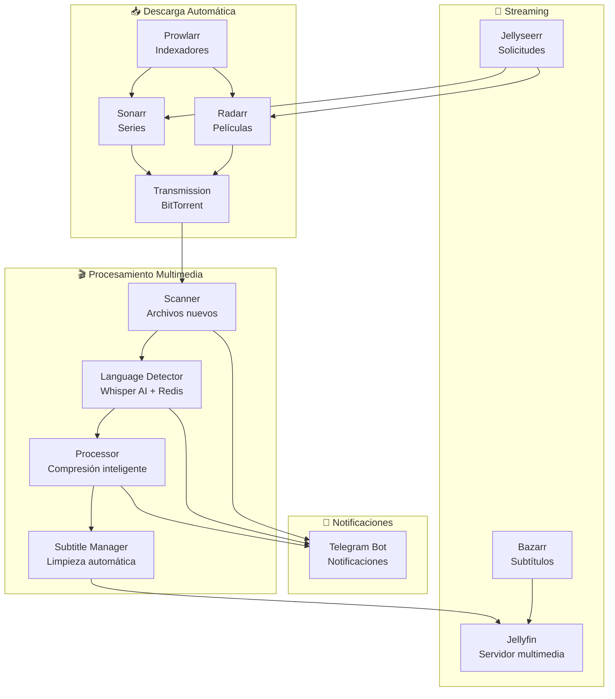

# MediaJelly - Servidor Multimedia Automatizado 🎬

[](docker-compose.yaml)
[](requirements.txt)
[](LICENSE)
[](http://localhost:9092)

Un servidor multimedia completamente automatizado con Docker, que incluye descarga, organización, compresión inteligente, detección de idiomas con IA y notificaciones por Telegram.

## 🚀 Características principales

- **🎯 Totalmente automatizado**: Descarga, organiza y comprime contenido automáticamente
- **🧠 Detección inteligente de idiomas**: Análisis automático de audio con Whisper AI para subtítulos precisos
- **🧹 Limpieza automática de subtítulos**: Eliminación de duplicados y archivos de baja calidad
- **📱 Notificaciones Telegram**: Recibe reportes de éxito y errores con emojis informativos
- **⏰ Ejecución programada**: Cron jobs para procesamiento automático cada 12 horas
- **🗜️ Compresión inteligente**: Optimización basada en el tamaño del archivo con límites de recursos
- **🔧 Recuperación de errores**: Manejo robusto de interrupciones y archivos corruptos
- **📊 Monitorización:** opcional (Prometheus + Grafana)
- **🏗️ Infraestructura optimizada**: Docker Compose con healthchecks, límites de memoria y CPU
- **🚀 Alto rendimiento**: Cache Redis para detección de idiomas, procesamiento paralelo

## 🏗️ Arquitectura del sistema



### 🔄 Flujo de procesamiento

1. **Descarga** → Sonarr/Radarr detectan solicitudes y descargan vía Transmission
2. **Escaneo** → Scanner identifica archivos nuevos cada 6 horas
3. **Análisis** → Language Detector analiza audio con Whisper AI (cacheado en Redis)
4. **Procesamiento** → Compresión inteligente basada en tamaño y calidad
5. **Limpieza** → Eliminación automática de subtítulos duplicados/corruptos
6. **Notificación** → Reportes por Telegram con emojis informativos

## 🐳 Servicios incluidos

| Servicio | Puerto | Memoria | CPU | Descripción | Estado |
|----------|--------|---------|-----|-------------|---------|
| **Sonarr** | 8989 | 1g | 1.5 | Descarga y organiza series automáticamente | ✅ |
| **Radarr** | 7878 | 1g | 1.5 | Descarga y organiza películas automáticamente | ✅ |
| **Prowlarr** | 9696 | 512MB | 1.0 | Gestor de indexadores torrent | ✅ |
| **Transmission** | 9091 | 512MB | 1.0 | Cliente BitTorrent | ✅ |
| **Bazarr** | 6767 | 512MB | 1.0 | Gestión automática de subtítulos | ✅ |
| **Jellyfin** | 8096 | 4g | 3.0 | Servidor de streaming multimedia | ✅ |
| **Jellyseerr** | 5055 | 500MB | 0.5 | Interface de solicitudes de contenido | ⚠️ |
| **mediajelly-cron** | - | 6g | 4.0 | Orquestador y procesamiento multimedia (container interno) | ⚠️ |
| **Redis** | 6379 | 256MB | 0.5 | Cache para detección de idiomas | ✅ |
| **Samba** | 139/445 | 256MB | 0.5 | Compartición SMB (acceso a media/ y scripts/) | ✅ |
| **telegram-transmission-bot** | - | 256MB | 0.5 | Bot Telegram para Transmission | ✅ |

### 📊 Métricas disponibles

- `mediajelly_files_processed_total` - Total de archivos procesados
- `mediajelly_compression_ratio` - Ratio de compresión promedio
- `mediajelly_language_detection_time` - Tiempo de detección de idiomas
- `mediajelly_errors_total` - Contador de errores por tipo
- `mediajelly_subtitle_cleanup_count` - Subtítulos limpiados

## 📁 Estructura del proyecto

```text
mediaJelly/
├── docker-compose.yaml          # Configuración de servicios con límites de recursos
├── media/                       # Contenido multimedia
│   ├── Peliculas/              # Películas organizadas
│   ├── series/                 # Series organizadas
│   └── anime/
├── config/                     # Configuraciones persistentes
│   ├── telegram.conf          # Credenciales de Telegram (no versionado)
│   └── */                     # Configs de cada servicio
└── scripts/                   # Scripts de automatización Python
    ├── mediajelly_cron_runner.py    # Orquestador principal del sistema
    ├── mediajelly_scanner.py        # Escaneo inteligente de archivos nuevos
    ├── mediajelly_processor.py      # Compresión y procesamiento multimedia
    ├── mediajelly_language_detector.py # Detección de idiomas con Whisper AI
    ├── mediajelly_subtitle_translator.py # Traducción automática de subtítulos
    ├── mediajelly_notifier.py       # Sistema de notificaciones Telegram
    ├── clean_duplicate_subtitles.py # Limpieza de subtítulos duplicados
    ├── cancel_processing.sh         # Cancelación de procesos en ejecución
    ├── logs/                        # Logs del sistema
    └── tmp/                         # Archivos temporales
```

## ⚡ Instalación y configuración

### Prerrequisitos

- **Docker**: Versión 20.10+
- **Docker Compose**: Versión 2.0+
- **Git**: Para clonar el repositorio
- **4GB RAM mínimo** (8GB recomendado)
- **Espacio en disco**: 100GB+ para contenido multimedia

### 1. Clona el repositorio

```bash
git clone https://github.com/CristianTafur249/mediaJelly.git
cd mediaJelly
```

### 2. Configura las variables de entorno

```bash
# Copia el archivo de ejemplo
cp .env.example .env

# Edita las variables según tu configuración
nano .env
```

**Variables importantes:**

```bash
# Zona horaria
TZ=America/Bogota

# IDs de usuario/grupo para permisos de archivos
PUID=1000
PGID=1000

# Credenciales de Grafana
GRAFANA_ADMIN_USER=admin
GRAFANA_ADMIN_PASSWORD=tu_password_seguro

# Modo de MediaJelly (python para procesamiento completo)
MEDIAJELLY_MODE=python
```

### 3. Configura Telegram (opcional pero recomendado)

```bash
cp config/telegram.conf.example config/telegram.conf
nano config/telegram.conf
```

### 4. Inicia los servicios

```bash
# Construye e inicia todos los servicios
docker-compose up -d

# Verifica que todos los servicios estén funcionando
docker-compose ps
```

### 5. Configuración inicial de servicios

1. **Accede a los servicios web:**
   - Jellyfin: <http://localhost:8096>
   - Jellyseerr: <http://localhost:5055>
   - Portainer: <http://localhost:9000>
   - Grafana: <http://localhost:3000>

2. **Configura Sonarr/Radarr/Prowlarr** según la documentación oficial

3. **Verifica métricas:** <http://localhost:9092>

### 6. Ejecuta el procesamiento inicial

```bash
# Ejecuta un escaneo manual
docker-compose exec mediajelly-cron python3 scripts/mediajelly_scanner.py

# O procesa archivos específicos
docker-compose exec mediajelly-cron python3 scripts/mediajelly_processor.py /ruta/a/archivo.mp4
```

# Edita el archivo con tus credenciales de Telegram

```

## ⚙️ Configuración avanzada

### Variables de entorno

| Variable | Default | Descripción |
|----------|---------|-------------|
| `TZ` | `America/Bogota` | Zona horaria del sistema |
| `PUID` | `1000` | ID de usuario para permisos de archivos |
| `PGID` | `1000` | ID de grupo para permisos de archivos |
| `MEDIAJELLY_MODE` | `python` | Modo de ejecución (python/bash) |
| `GRAFANA_ADMIN_USER` | `admin` | Usuario admin de Grafana |
| `GRAFANA_ADMIN_PASSWORD` | `admin` | Password admin de Grafana |

### Configuración de Telegram

```bash
# Crear bot con BotFather
# Obtener chat_id con userinfobot
cp config/telegram.conf.example config/telegram.conf

# Editar configuración
nano config/telegram.conf
```

**Ejemplo de configuración:**

```bash
TELEGRAM_BOT_TOKEN="1234567890:ABCdefGHIjklMNOpqrsTUVwxyz"
TELEGRAM_CHAT_ID="123456789"
NOTIFY_ON_SUCCESS=true
NOTIFY_ON_ERROR=true
EMOJI_ENABLED=true
```

## 🚀 Uso y comandos

### Comandos principales

```bash
# Ver estado de todos los servicios
docker-compose ps

# Ver logs en tiempo real
docker-compose logs -f mediajelly-cron

# Ejecutar escaneo manual
docker-compose exec mediajelly-cron python3 scripts/mediajelly_scanner.py

# Procesar archivo específico
docker-compose exec mediajelly-cron python3 scripts/mediajelly_processor.py /ruta/archivo.mp4

# Detectar idioma de archivo
docker-compose exec mediajelly-cron python3 scripts/mediajelly_language_detector.py

# Limpiar subtítulos duplicados
docker-compose exec mediajelly-cron python3 scripts/clean_duplicate_subtitles.py

# Ver métricas en Prometheus
curl http://localhost:9092/api/v1/query?query=mediajelly_files_processed_total
```

### API REST

La API REST está disponible en `http://localhost:8000`:

```bash
# Estado del sistema
curl http://localhost:8000/status

# Lista de tareas pendientes
curl http://localhost:8000/queue

# Estadísticas de procesamiento
curl http://localhost:8000/stats
```

## 🔧 Troubleshooting

### Problemas comunes y soluciones

#### ❌ Servicios no inician

**Síntomas:** `docker-compose ps` muestra contenedores con estado "Exit"

**Soluciones:**

```bash
# Ver logs detallados
docker-compose logs servicio_nombre

# Reiniciar servicio específico
docker-compose restart servicio_nombre

# Recrear contenedor desde cero
docker-compose up -d --force-recreate servicio_nombre
```

#### ❌ Error de permisos en archivos

**Síntomas:** Errores de "Permission denied" en logs

**Soluciones:**

```bash
# Verificar IDs de usuario/grupo
id $USER

# Actualizar variables de entorno en .env
PUID=$(id -u)
PGID=$(id -g)

# Reiniciar servicios
docker-compose down && docker-compose up -d
```

#### ❌ Jellyseerr no funciona

**Síntomas:** Puerto 5055 no responde

**Solución:** Jellyseerr tiene problemas conocidos de estabilidad

```bash
# Verificar logs
docker-compose logs jellyseerr

# Reiniciar servicio
docker-compose restart jellyseerr

# O deshabilitar temporalmente en docker-compose.yaml
# services:
#   jellyseerr:
#     profiles: ["disabled"]
```

#### ❌ Detección de idiomas falla

**Síntomas:** Errores de Whisper AI

**Soluciones:**

```bash
# Verificar que Redis esté funcionando
docker-compose ps redis

# Limpiar cache de idiomas
docker-compose exec redis redis-cli FLUSHALL

# Verificar logs del detector
docker-compose logs mediajelly-cron | grep -i whisper
```

#### ❌ Compresión se queda atascada

**Síntomas:** Procesos de ffmpeg corriendo indefinidamente

**Soluciones:**

```bash
# Cancelar procesos atascados
docker-compose exec mediajelly-cron ./scripts/cancel_processing.sh

# Ver procesos activos
docker-compose exec mediajelly-cron ps aux | grep ffmpeg

# Verificar límites de CPU/memoria
docker-compose exec mediajelly-cron python3 -c "import psutil; print(f'CPU: {psutil.cpu_percent()}%, RAM: {psutil.virtual_memory().percent}%')"
```

#### ❌ Notificaciones Telegram no llegan

**Síntomas:** No se reciben mensajes en Telegram

**Soluciones:**

```bash
# Verificar configuración
docker-compose exec mediajelly-cron cat /mediajelly/config/telegram.conf

# Probar envío manual
docker-compose exec mediajelly-cron python3 -c "
from mediajelly_notifier import TelegramNotifier
notifier = TelegramNotifier()
notifier.send_message('Test message')
"

# Verificar conectividad
docker-compose exec mediajelly-cron curl -s https://api.telegram.org
```

### 🔍 Diagnóstico avanzado

#### Ver uso de recursos

```bash
# Uso de CPU y memoria por contenedor
docker stats

# Espacio en disco
df -h

# Logs de errores recientes
docker-compose logs --tail=100 | grep -i error
```

#### Backup y restauración

```bash
# Backup de configuraciones
tar -czf backup_configs_$(date +%Y%m%d).tar.gz config/

# Backup de base de datos Redis
docker-compose exec redis redis-cli SAVE

# Restaurar desde backup
docker-compose exec redis redis-cli RESTORE backup.rdb
```

## ❓ FAQ

### ¿Cuánto espacio necesito?

- **Mínimo:** 100GB para sistema operativo + 500GB para contenido
- **Recomendado:** 1TB+ para contenido multimedia
- **Cache Redis:** ~256MB máximo
- **Logs:** Rotación automática, ~10MB por servicio

### ¿Cómo actualizo MediaJelly?

```bash
# Backup de configuraciones
cp -r config/ config.backup/

# Actualizar código
git pull origin main

# Recrear servicios con nuevas imágenes
docker-compose down
docker-compose pull
docker-compose up -d

# Restaurar configuraciones si es necesario
cp config.backup/* config/
```

### ¿Puedo usar solo algunos servicios?

Sí, edita `docker-compose.yaml` y comenta los servicios que no necesites:

```yaml
# Deshabilitar Jellyseerr
# services:
#   jellyseerr:
#     ...
```

### ¿Cómo monitorizar el rendimiento?

- **Grafana:** <http://localhost:3000> (admin/admin)
- **Prometheus:** <http://localhost:9092>
- **API Metrics:** <http://localhost:8000/metrics>

### ¿Qué formatos de video soporta?

- **Entrada:** MP4, MKV, AVI, MOV, WMV, FLV
- **Salida:** MP4 optimizado con H.264/AAC
- **Subtítulos:** SRT, ASS, VTT (automático con Bazarr)

### Problemas de rendimiento

Si experimentas lentitud:

1. **Verifica límites de recursos** en `docker-compose.yaml`
2. **Aumenta CPUs** para servicios de procesamiento
3. **Agrega más RAM** (mínimo 8GB recomendado)
4. **Usa SSD** para almacenamiento
5. **Configura cache Redis** correctamente

## 🤝 Contribuir

### Desarrollo local

```bash
# Clonar repositorio
git clone https://github.com/CristianTafur249/mediaJelly.git
cd mediaJelly

# Crear entorno virtual
python3 -m venv .venv
source .venv/bin/activate

# Instalar dependencias
pip install -r requirements.txt

# Ejecutar tests
python3 -m pytest

# Formatear código
black scripts/
```

### Reportar bugs

1. Verifica logs: `docker-compose logs > debug.log`
2. Incluye información del sistema: `docker --version && docker-compose --version`
3. Abre issue en GitHub con logs y pasos para reproducir

### Pull Requests

1. Fork el proyecto
2. Crea rama descriptiva: `git checkout -b fix/language-detection-bug`
3. Commit cambios: `git commit -m "Fix: Corregir detección de idiomas"`
4. Push: `git push origin fix/language-detection-bug`
5. Abre PR con descripción detallada

## 📄 Licencia

Este proyecto está bajo la **Licencia MIT**. Ver [LICENSE](LICENSE) para más detalles.

---

## 🙏 Agradecimientos

- **Whisper AI** - OpenAI por el modelo de detección de idiomas
- **Docker** - Contenedorización
- **Prometheus/Grafana** - Monitoreo y métricas
- **Comunidad de *arr** - Sonarr, Radarr, Prowlarr
- **Jellyfin** - Servidor multimedia

---

> **MediaJelly** - Automatización completa para tu servidor multimedia casero 🎬✨

```

### 3. Inicia los servicios

```bash
docker compose up -d
```

### 4. Configura el cron job (opcional)

```bash
# Añade esta línea a tu crontab (crontab -e)
0 */6 * * * /home/tu_usuario/mediaJelly/scripts/cron-runner.sh
```

## 🔧 Configuración de Telegram

1. Crea un bot con [@BotFather](https://t.me/BotFather) en Telegram
2. Obtén tu `chat_id` enviando `/start` a [@userinfobot](https://t.me/userinfobot)
3. Edita `config/telegram.conf`:

```bash
TELEGRAM_BOT_TOKEN="tu_bot_token_aqui"
TELEGRAM_CHAT_ID="tu_chat_id_aqui"
NOTIFY_ON_SUCCESS=true
NOTIFY_ON_ERROR=true
```

## 📋 Uso manual

### Escanear y procesar contenido

```bash
# Escanear toda la biblioteca de medios
./scripts/scan-to-pending.sh /path/to/media

# Escanear solo películas
./scripts/scan-to-pending.sh /path/to/media/Peliculas

# Escanear solo series
./scripts/scan-to-pending.sh /path/to/media/series
```

### Probar notificaciones

```bash
./scripts/telegram-notify.sh test
```

### Limpiar archivos corruptos

```bash
./scripts/cleanup-partial-compressed.sh /path/to/media
```

## 🎛️ Compresión inteligente

El sistema adapta la compresión según el tamaño del archivo:

- **Archivos > 2GB**: Compresión agresiva (`qp 32, preset slow`)
- **Archivos > 1GB**: Compresión moderada (`qp 30, preset medium`)
- **Archivos < 1GB**: Compresión rápida (`qp 28, preset fast`)
- **Archivos < 500MB**: Solo renombrado a MP4

## 📊 Gestión de logs

- Los logs se rotan automáticamente cuando superan 10MB
- Se mantienen máximo 5 archivos comprimidos por tipo
- Limpieza automática de archivos antiguos

## 🔒 Archivos no versionados

Los siguientes archivos se excluyen del control de versiones:

- `config/telegram.conf` - Credenciales de Telegram
- `media/*` - Contenido multimedia
- `scripts/logs/*` - Logs del sistema
- `scripts/tmp/*` - Archivos temporales

## 🐍 Scripts Python del Sistema

### Core Scripts

| Script | Función | Descripción |
|--------|---------|-------------|
| **mediajelly_cron_runner.py** | 🕐 Orquestador principal | Coordina escaneo, detección de idiomas, procesamiento y notificaciones |
| **mediajelly_scanner.py** | 🔍 Escáner inteligente | Detecta archivos nuevos y pendientes de procesamiento |
| **mediajelly_language_detector.py** | 🗣️ Detector de idiomas | Usa Whisper AI para analizar audio y detectar idiomas |
| **mediajelly_processor.py** | 🗜️ Procesador multimedia | Compresión inteligente con algoritmos adaptativos |
| **mediajelly_subtitle_translator.py** | 🌐 Traductor de subtítulos | Traducción automática con doble pasada para calidad |
| **mediajelly_notifier.py** | 📱 Notificador Telegram | Sistema de notificaciones con emojis y estado persistente |

### Utility Scripts

| Script | Función | Descripción |
|--------|---------|-------------|
| **clean_duplicate_subtitles.py** | 🧹 Limpiador de subtítulos | Elimina duplicados y archivos de baja calidad (.hi.srt, .es-MX.srt) |
| **cancel_processing.sh** | 🛑 Cancelador de procesos | Detiene procesos de compresión en ejecución |

### Funcionalidades Clave

- **🗣️ Detección Inteligente**: Análisis de audio con Whisper AI para subtítulos precisos
- **🧹 Limpieza Automática**: Eliminación de subtítulos duplicados y de baja calidad
- **📊 Estado Persistente**: Seguimiento de progreso y notificaciones para evitar duplicados
- **🔄 Recuperación de Errores**: Reintentos automáticos y manejo robusto de fallos
- **⚡ Optimización de Recursos**: Límites de memoria, CPU y healthchecks en Docker

## 🐛 Solución de problemas

### Error de permisos en archivos de lock

Si encuentras errores como `Permission denied: '/mediajelly/scripts/tmp/cron_python.lock'`:

```bash
# Ejecutar el script de corrección de permisos
sudo ./scripts/fix_permissions.sh
```

Este script:

- Ajusta los permisos de directorios críticos (`tmp/` y `logs/`)
- Elimina archivos de lock antiguos que puedan causar problemas
- Asegura que los scripts Python sean ejecutables

### Error de permisos general

```bash
chmod +x scripts/*.sh
chmod +x scripts/*.py
```

### Problema con archivos parcialmente comprimidos

```bash
./scripts/cleanup-partial-compressed.sh /path/to/media
```

### Verificar estado de servicios

```bash
docker compose logs -f servicio_nombre
```

## 📖 Documentación adicional

- [CHANGELOG.md](CHANGELOG.md) - Historial de cambios
- [docker-compose.yaml](docker-compose.yaml) - Configuración de servicios

## 🤝 Contribuir

1. Fork el proyecto
2. Crea una rama para tu feature (`git checkout -b feature/nueva-caracteristica`)
3. Commit tus cambios (`git commit -am 'Agregar nueva característica'`)
4. Push a la rama (`git push origin feature/nueva-caracteristica`)
5. Abre un Pull Request

## 📄 Licencia

Este proyecto está bajo la Licencia MIT. Ver [LICENSE](LICENSE) para más detalles.
4. Los scripts de procesamiento se ejecutan automáticamente al final del escaneo, pero puedes lanzarlos manualmente si lo deseas.

## Notas

- Los scripts requieren `ffmpeg` instalado en el sistema anfitrión.
- Los archivos menores a 1GB solo se renombran y mueven, no se comprimen.
- Los logs se almacenan en `scripts/logs/`.

---

> Proyecto personal para automatizar la gestión y streaming de contenido multimedia en el hogar, utilizando tecnologías de código abierto y contenedores ligeros.
